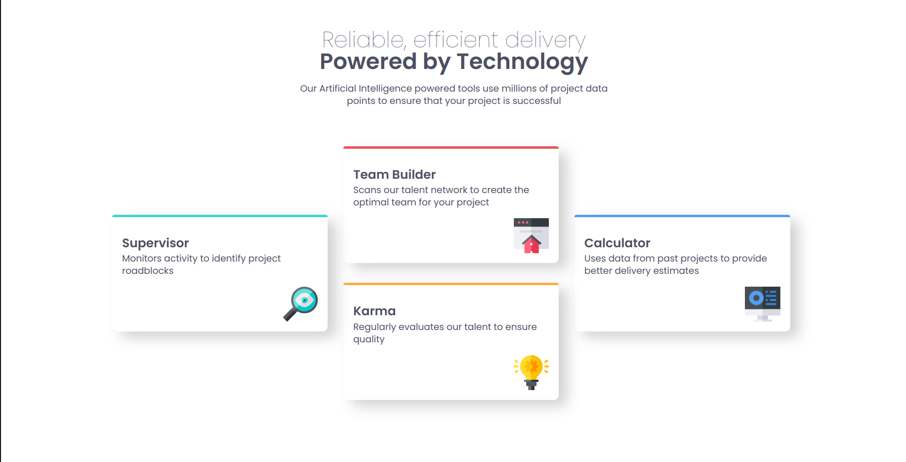

# Frontend Mentor - Four card feature section solution

This is a solution to the [Four card feature section challenge on Frontend Mentor](https://www.frontendmentor.io/challenges/four-card-feature-section-weK1eFYK). Frontend Mentor challenges help you improve your coding skills by building realistic projects.

## Table of contents

- [Overview](#overview)
  - [The challenge](#the-challenge)
  - [Screenshot](#screenshot)
  - [Links](#links)
- [My process](#my-process)
  - [Built with](#built-with)
  - [Useful resources](#useful-resources)
- [Author](#author)

## Overview

### The challenge

Users should be able to:

- View the optimal layout for the site depending on their device's screen size

### Screenshot

### Links

- Solution URL: [GitHub](https://github.com/alfonso-ramos/four-card-featured-section)
- Live Site URL: [Live site](https://alfonso-ramos.github.io/four-card-featured-section/)

## My process

### Built with

- Semantic HTML5 markup
- CSS custom properties
- Flexbox
- CSS Grid
- Mobile-first workflow

### Useful resources

- [ CSS Grid Layout Guide ](https://css-tricks.com/snippets/css/complete-guide-grid/) - This guide always helps me when i need use css grid in my projects

## Author

## Author
- Website - [ponchoramos.com](https://www.ponchoramos.com)
- Frontend Mentor - [@alfonso-ramos](https://www.frontendmentor.io/profile/alfonso-ramos)
- Threads - [@ponchoramosdev](https://www.threads.net/@ponchoramosdev?hl=es-la)

